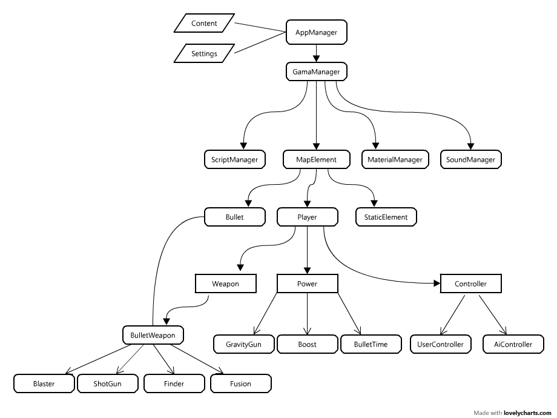

# The Ball Game by b4n92uid

TheBall is game in C++/OpenGL developped for educational purpose

## Author

- [BELDJOUHRI Abdelghani](contact@beldjouhri-abdelghani.com)

## Contributors

- skynet1994 : Portage linux
- mouradski : Portage linux
- edhelas : Portage linux
- terteur : Concept art
- Newin : Concept art

## Documentation



- [Level Script API](./docs/script.md)
- [Level Parameters](./docs/map.md)
- [FAQ](./docs/faq.md)

## Generating code documentation

```bash
cd doxygen
doxygen Doxyfile
```

## Compile

Download required libraries :

- Boost (v1.61)
  - DateTime
  - FileSystem
  - System
- DevIL (v1.7.8)
- FMOD (v4.44.32)
- FreeType (v2.3.5-1)
- Lua (v5.1.4)
- Newton Game Dynamics (v3.13)
- RocketLib (v1.3.0)
- SDL (v1.2.15)
- TinyXML
- TheBall engine (dev-master)

Create build directory

```sh
mkdir build
cd build
```

Generate project file

```sh
cmake -G "Visual Studio 15 2017" ..
```

Setup flags for third-party library in `build/CMakeCache.txt`

```
//Boost
THEBALL_BOOST_INC:PATH=D:/librairies/cpp/boost/boost_1_61_0

//Boost libs
THEBALL_BOOST_LIBS:FILEPATH=libboost_system-mgw53-1_61.a

//Boost lib dir
THEBALL_BOOST_LIB_DIR:PATH=D:/librairies/cpp/boost/boost_1_61_0/stage/lib

//Devil
THEBALL_DEVIL_INC:PATH=D:/librairies/cpp/devil/DevIL-SDK-x86-1.7.8/include

//Devil lib
THEBALL_DEVIL_LIB:FILEPATH=D:/librairies/cpp/devil/DevIL-SDK-x86-1.7.8/lib/DevIL.lib

//Fmod
THEBALL_FMOD_INC:PATH=C:/fmodex/api/inc

//Fmod lib
THEBALL_FMOD_LIB:FILEPATH=C:/fmodex/api/lib/libfmodex.a

//Freetype
THEBALL_FREETYPE_INC:PATH=D:/librairies/cpp/freetype/freetype-2.3.5-1-bin/include

//Freetype lib
THEBALL_FREETYPE_LIB:FILEPATH=D:/librairies/cpp/freetype/freetype-2.3.5-1-bin/lib/freetype.lib

//Lua
THEBALL_LUA_INC:PATH=D:/librairies/cpp/lua/lua5_1_4_Win32_dll8_lib/include

//Lua lib
THEBALL_LUA_LIB:FILEPATH=D:/librairies/cpp/lua/lua5_1_4_Win32_dll8_lib/lua51.lib

//Newton
THEBALL_NEWTON_INC:PATH=D:/librairies/cpp/newton/newton-dynamics-2.36/coreLibrary_200/source/newton

//Newton lib
THEBALL_NEWTON_LIB:FILEPATH=D:/librairies/cpp/newton/newton-dynamics-2.36/packages/Win32/debugDll/newton_d.lib

//Rocket
THEBALL_ROCKET_INC:PATH=D:/librairies/cpp/librocket/libRocket/Include

//Rocket lib
THEBALL_ROCKET_LIB:FILEPATH=libRocketControls.dll.a;libRocketCore.dll.a;libRocketDebugger.dll.a

//Rocket lib dir
THEBALL_ROCKET_LIB_DIR:PATH=D:/librairies/cpp/librocket/libRocket/Build/msys.debug

//Sdl
THEBALL_SDL_INC:PATH=D:/librairies/cpp/sdl/SDL/SDL-1.2.15/include

//Sdl lib
THEBALL_SDL_LIB:FILEPATH=SDL.lib;SDLmain.lib

//Sdl lib dir
THEBALL_SDL_LIB_DIR:PATH=D:/librairies/cpp/sdl/SDL/SDL-1.2.15/lib

//Tbengine
THEBALL_TBENGINE_INC:PATH=D:/projects/dev/theball/tbengine/sources

//Tbengine plugins
THEBALL_TBENGINE_INC_PLUGINS:PATH=D:/projects/dev/theball/tbengine/plugins

//Tbengine lib
THEBALL_TBENGINE_LIB:FILEPATH=D:/projects/dev/theball/tbengine/build/Debug/tbengine.lib
```

Build !

```bash
MSBuild theball-game.vcxproj
```
